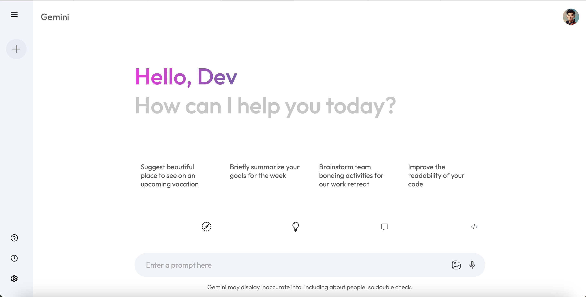
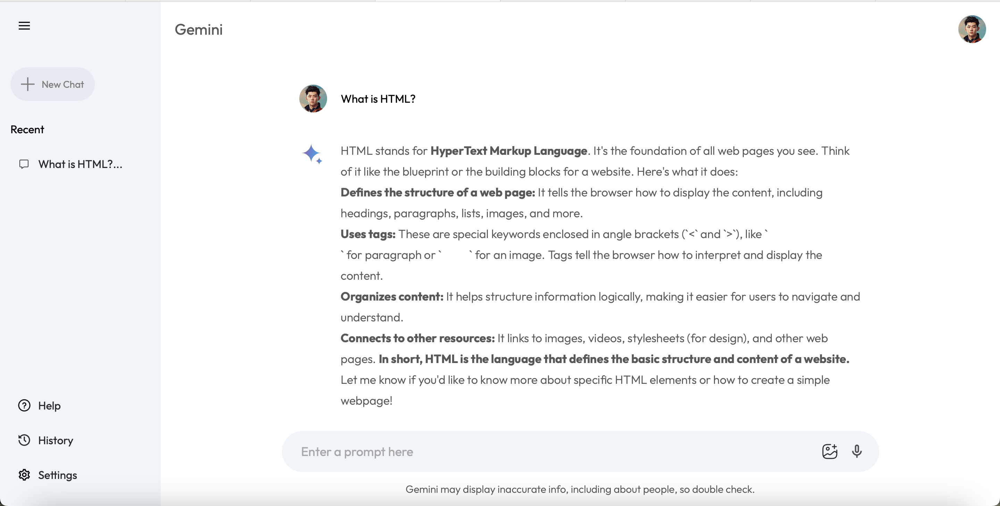
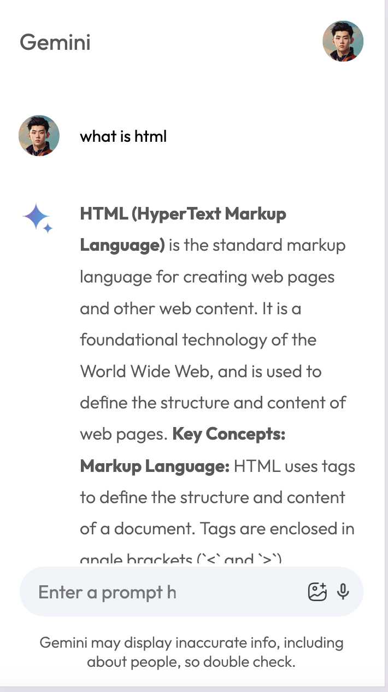

# GEMINI API Responsive Web Application
**Description**: This project is a responsive web application built using React.

## Demo Links
- [Live Demo](https://sonali-gemini-api-project.netlify.app/)

## Tech Stacks
- **Frontend**: React.js, HTML, CSS
- **API**: GEMINI API
- **Development Tools**: Visual Studio Code, create-react-app
- **Version Control**: Git, GitHub

## Features
- **Responsive Design**: The application is fully responsive and adapts to various screen sizes.
- **Real-time Interaction**: Uses GEMINI API for real-time data fetching and interaction.
- **Dynamic Content**: Displays dynamic content based on user input and API responses.
- **Smooth Animations**: Implemented smooth transitions and animations for a better user experience.

## Screenshots
1. **Home Page**
    *(Replace # with the path to your screenshot)*
2. **Home Page With Prompt**
   
2. **Home Page Responsive **
    

